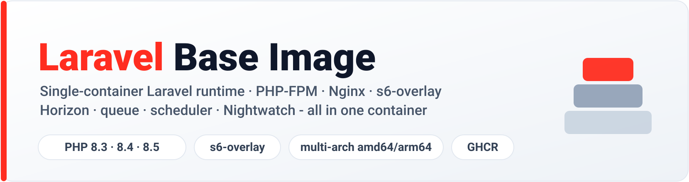

<p align="center">
    <picture>
        <source media="(prefers-color-scheme: dark)" srcset="art/header-dark.svg">
        
    </picture>
</p>

A production-ready, **single-container** Docker base image for Laravel applications.
PHP-FPM and Nginx are bundled with Horizon, the queue worker, the scheduler, and the
Nightwatch agent - all supervised in one container by [s6-overlay](https://github.com/just-containers/s6-overlay).

Built on top of [`serversideup/php`](https://github.com/serversideup/docker-php), published to the
GitHub Container Registry for **PHP 8.3, 8.4 and 8.5**, and meant to be extended by your
application with `FROM`.

[](https://github.com/midsonlajeanty/docker-laravel/actions/workflows/build.yml)
[](https://github.com/midsonlajeanty/docker-laravel/pkgs/container/laravel)


---

## Table of contents

- [Why this image](#why-this-image)
- [Features](#features)
- [Quick start](#quick-start)
- [Image tags](#image-tags)
- [What's inside](#whats-inside)
- [Process management](#process-management)
- [Configuration](#configuration)
- [Initialization (migrations & caches)](#initialization-migrations--caches)
- [Usage examples](#usage-examples)
- [Building locally](#building-locally)
- [Publishing & CI](#publishing--ci)
- [Repository layout](#repository-layout)
- [Maintenance](#maintenance)
- [Contributing](#contributing)
- [License](#license)
- [Acknowledgements](#acknowledgements)

## Why this image

Most Laravel Docker setups run a separate container for the web server, the queue worker,
the scheduler, and Horizon. That is the textbook approach, but it is operationally heavy for
small to mid-sized deployments (more containers to orchestrate, network, and monitor).

This image takes the opposite, deliberate trade-off: **everything runs in one container**,
supervised by s6-overlay, with each process individually toggleable. You get a single
artifact to ship, scale, and reason about - while still honoring the defaults and
conventions of `serversideup/php`.

It ships **no application code and no custom Artisan commands** - it is a pure base image.
Your application provides the code; this image provides the runtime and the supervision.

## Features

- 🐘 **PHP 8.3 / 8.4 / 8.5 + Nginx + PHP-FPM** on Alpine, from `serversideup/php`.
- 🧰 **All-in-one supervision** via s6-overlay: web, Horizon, queue worker, scheduler, Nightwatch.
- 🔀 **Per-process toggles** through your `.env` - enable only what you need.
- ♻️ **Horizon ⇄ queue worker fallback**: a plain `queue:work` runs automatically when Horizon is disabled.
- 🔒 **Runs as a non-root user** (`www-data`, configurable UID/GID).
- 🏗️ **Multi-architecture**: `linux/amd64` and `linux/arm64`.
- 🚀 **Two variants per PHP version**: `production` (OPcache on) and `development` (OPcache off, errors to stderr).
- 🤖 **CI/CD included**: GitHub Actions builds the full matrix and rebuilds weekly for patches.

## Quick start

Pull the image for the PHP version you target:

```bash
docker pull ghcr.io/midsonlajeanty/laravel:8.5-fpm-nginx-alpine
```

Extend it from your Laravel application's `Dockerfile`:

```dockerfile
FROM ghcr.io/midsonlajeanty/laravel:8.5-fpm-nginx-alpine

# Copy your application and install production dependencies
COPY --chown=www-data:www-data . /var/www/html
RUN composer install --no-dev --no-interaction --prefer-dist \
    && composer dump-autoload --optimize
```

The web server listens on **port `8080`** and exposes a **`/healthcheck`** endpoint.

## Image tags

Tags follow the `serversideup/php` convention: **floating** tags of the form
`{php-version}-fpm-nginx-alpine`, with a `-dev` suffix for the development variant. They are
**mutable** and rebuilt weekly so they pick up upstream security patches. There are no
semver/pinned tags.

| PHP version | Production (OPcache on)      | Development (OPcache off)        |
| ----------- | --------------------------- | -------------------------------- |
| 8.5         | `8.5-fpm-nginx-alpine`      | `8.5-fpm-nginx-alpine-dev`       |
| 8.4         | `8.4-fpm-nginx-alpine`      | `8.4-fpm-nginx-alpine-dev`       |
| 8.3         | `8.3-fpm-nginx-alpine`      | `8.3-fpm-nginx-alpine-dev`       |

```bash
docker pull ghcr.io/midsonlajeanty/laravel:8.5-fpm-nginx-alpine       # production
docker pull ghcr.io/midsonlajeanty/laravel:8.5-fpm-nginx-alpine-dev   # development
```

> **Pin by digest for reproducible deployments.** Because these tags are mutable, pin to a
> specific digest in production (`...laravel@sha256:...`) when you need immutability.

## What's inside

| Component        | Detail                                                                    |
| ---------------- | ------------------------------------------------------------------------- |
| Base image       | `serversideup/php:{8.3,8.4,8.5}-fpm-nginx-alpine`                          |
| Web server       | Nginx (mainline, pulled from the official `nginx.org` Alpine repository)   |
| App server       | PHP-FPM                                                                    |
| Supervisor       | s6-overlay (PID 1)                                                         |
| PHP extensions   | base set + `sockets`, `pcntl` (required by Horizon)                        |
| CLI tools        | `git`, `git-lfs`, `jq`, `lsof`                                             |
| User             | `www-data` (UID/GID `9999` by default, configurable)                      |
| Exposed port     | `8080` (HTTP), with `/healthcheck`                                         |
| Upload limits    | `upload_max_filesize` / `post_max_size` = `256M`                          |

## Process management

All long-running processes are supervised by s6-overlay **inside the same container**. Each
is controlled by a flag in your application's `.env` file:

| Service            | Command                        | Runs when…                                            |
| ------------------ | ------------------------------ | ----------------------------------------------------- |
| `nginx` + `php-fpm`| _(provided by `serversideup/php`)_ | always                                            |
| `horizon`          | `php artisan horizon`          | unless `HORIZON_ENABLED=false`                        |
| `queue-worker`     | `php artisan queue:work`       | **only when `HORIZON_ENABLED=false`** (Horizon's fallback) |
| `scheduler-worker` | `php artisan schedule:work`    | unless `SCHEDULER_ENABLED=false`                      |
| `nightwatch-agent` | `php artisan nightwatch:agent` | when `NIGHTWATCH_ENABLED=true`                        |

### Horizon and the queue worker are mutually exclusive

`horizon` and `queue-worker` are exact inverses of each other, so jobs are never processed
twice:

- **Horizon enabled** (default): Horizon manages the queue workers; `queue-worker` sleeps.
- **Horizon disabled** (`HORIZON_ENABLED=false`): the plain `queue:work` worker takes over.

This lets you ship a single image and decide per environment whether to run Horizon (which
requires Redis) or a simple queue worker.

> **Required packages.** The service scripts call standard Artisan commands. `queue:work`
> and `schedule:work` are part of Laravel core; `horizon` and `nightwatch:agent` require
> [`laravel/horizon`](https://laravel.com/docs/horizon) and
> [`laravel/nightwatch`](https://nightwatch.laravel.com/) respectively
> (`composer require laravel/horizon laravel/nightwatch`).

## Configuration

### Process toggles (`.env`)

```dotenv
HORIZON_ENABLED=true       # set false to fall back to a plain queue:work worker
SCHEDULER_ENABLED=true
NIGHTWATCH_ENABLED=false
```

Toggles are read from the **`.env` file** in `/var/www/html` (not from the container
environment). The value must be a bare `true`/`false` - **unquoted**. Whitespace around the
`=`, a leading indent, and letter case are tolerated; quotes are not
(`HORIZON_ENABLED="false"` will **not** be recognized).

### Build arguments

| Argument                    | Default                        | Purpose                                      |
| --------------------------- | ------------------------------ | -------------------------------------------- |
| `SERVERSIDEUP_PHP_VERSION`  | `8.5-fpm-nginx-alpine`         | Base `serversideup/php` tag (sets the PHP version) |
| `NGINX_VERSION`             | `1.31.0-r1`                    | Pinned Nginx package version (see [Maintenance](#maintenance)) |
| `USER_ID`                   | `9999`                         | UID for `www-data`                           |
| `GROUP_ID`                  | `9999`                         | GID for `www-data`                           |

### Runtime environment

| Variable             | Default | Purpose                                           |
| -------------------- | ------- | ------------------------------------------------- |
| `PHP_MEMORY_LIMIT`   | `512M`  | PHP `memory_limit`                                |
| `PHP_OPCACHE_ENABLE` | `1` (prod) / `0` (dev) | Toggle OPcache (set per variant) |

## Initialization (migrations & caches)

One-shot startup tasks - database migrations, config/route/view caching, the storage
symlink - are handled by the **native `serversideup/php` automations**, which run inside the
same container at startup. **No custom commands, no extra container.**

These automations are **disabled by default** (`AUTORUN_ENABLED=false`). Opt in at runtime:

```dotenv
AUTORUN_ENABLED=true                 # master switch for the Laravel automations
AUTORUN_LARAVEL_MIGRATION=true       # php artisan migrate --force
AUTORUN_LARAVEL_CONFIG_CACHE=true
AUTORUN_LARAVEL_ROUTE_CACHE=true
AUTORUN_LARAVEL_VIEW_CACHE=true
AUTORUN_LARAVEL_STORAGE_LINK=true
# Seeding is intentionally left off (AUTORUN_LARAVEL_MIGRATION_SEED stays false)
```

See the [serversideup automations reference](https://serversideup.net/open-source/docker-php/docs/framework-guides/laravel/automations)
for the full list of variables. These cover **one-shot init only** - long-running processes
(Horizon, queue, scheduler, Nightwatch) remain managed by the s6 services above.

## Usage examples

### Production `Dockerfile`

```dockerfile
FROM ghcr.io/midsonlajeanty/laravel:8.5-fpm-nginx-alpine

COPY --chown=www-data:www-data . /var/www/html
RUN composer install --no-dev --no-interaction --prefer-dist \
    && composer dump-autoload --optimize
```

### `docker compose` (production)

```yaml
services:
  app:
    image: ghcr.io/midsonlajeanty/laravel:8.5-fpm-nginx-alpine
    ports:
      - "80:8080"
    environment:
      AUTORUN_ENABLED: "true"          # run migrations & caches on boot
    env_file:
      - .env
    healthcheck:
      test: ["CMD", "curl", "-f", "http://localhost:8080/healthcheck"]
      interval: 30s
      timeout: 5s
      retries: 3
```

### Local development with a bind mount

```yaml
services:
  app:
    image: ghcr.io/midsonlajeanty/laravel:8.5-fpm-nginx-alpine-dev
    ports:
      - "8080:8080"
    volumes:
      - .:/var/www/html
    env_file:
      - .env
```

In development, run `composer install` and `php artisan migrate` as part of your normal
workflow (the image does not run them for you, matching the `serversideup/php` defaults).

## Building locally

```bash
# Production variant, PHP 8.5 (OPcache on)
docker build --target production -t laravel:8.5 .

# Development variant, PHP 8.5 (OPcache off, errors to stderr)
docker build --target development -t laravel:8.5-dev .

# A different PHP version is selected through the base-image build arg
docker build --target production \
  --build-arg SERVERSIDEUP_PHP_VERSION=8.4-fpm-nginx-alpine \
  -t laravel:8.4 .
```

Override the user mapping when needed:

```bash
docker build --target production \
  --build-arg USER_ID=1000 \
  --build-arg GROUP_ID=1000 \
  -t laravel:8.5 .
```

## Publishing & CI

Two workflows split the responsibilities:

- **[`ci.yml`](.github/workflows/ci.yml)** runs on **pull requests**: a **lint** stage
  (hadolint, actionlint, shellcheck), a **smoke test** (the image boots and Nginx + PHP-FPM
  come up), and a no-push **build** of the full matrix for validation.
- **[`build.yml`](.github/workflows/build.yml)** runs on **push to `main`**, a **weekly
  schedule** (so floating tags pick up upstream patches), and **manual dispatch**. It builds
  the full matrix - **PHP {8.3, 8.4, 8.5} × {production, development}** - for `linux/amd64`
  and `linux/arm64` and pushes to `ghcr.io/midsonlajeanty/laravel` using the repository's
  `GITHUB_TOKEN` (no extra secrets).

There is no release/tag step: tags are floating and continuously refreshed, mirroring
`serversideup/php`.

Published images carry **SBOM and provenance attestations**, are **signed with
[cosign](https://github.com/sigstore/cosign)** (keyless, via GitHub OIDC), and are **scanned
with [Trivy](https://trivy.dev/)** (results sent to the repository's Security tab). All
GitHub Actions are pinned by commit SHA.

### Verifying a published image

```bash
cosign verify ghcr.io/midsonlajeanty/laravel:8.5-fpm-nginx-alpine \
  --certificate-identity-regexp '^https://github.com/midsonlajeanty/docker-laravel/.*' \
  --certificate-oidc-issuer https://token.actions.githubusercontent.com
```

## Repository layout

```
.
├── Dockerfile                       # multi-stage: base → development / production
├── .dockerignore
├── docker/
│   ├── common/                      # config shared by both variants (copied in the base stage)
│   │   └── etc/
│   │       ├── nginx/               # custom.conf + site-opts (port 8080, healthcheck)
│   │       └── s6-overlay/          # horizon, queue-worker, scheduler-worker, nightwatch-agent
│   ├── development/etc/php/...      # dev php.ini (OPcache off, errors → stderr)
│   └── production/etc/php/...       # prod php.ini (OPcache on, errors → file)
└── .github/
    ├── workflows/
    │   ├── ci.yml                   # PR checks: lint, smoke, build validation
    │   └── build.yml               # publish to GHCR: build, sign, scan
    └── dependabot.yml
```

Files identical across variants live in `docker/common/` and are copied once in the `base`
stage; only the PHP `.ini` differs per variant.

## Maintenance

`NGINX_VERSION` is **pinned** in the `Dockerfile`. It must match a version available in the
mainline Nginx repository for the Alpine release shipped by the current `serversideup/php`
base images (verified working across PHP 8.3 – 8.5). **Bump it whenever the base image's
Alpine version changes**, otherwise `apk add nginx@nginx=<version>` will fail and break the
build. [Dependabot](.github/dependabot.yml) keeps the base image and the GitHub Actions up to
date.

## Contributing

Issues and pull requests are welcome. When changing the image:

1. Build both targets locally (`--target development` and `--target production`), ideally for
   each supported PHP version via `--build-arg SERVERSIDEUP_PHP_VERSION=...`.
2. Verify the s6 services are present and that Horizon ↔ queue-worker stay exact inverses.
3. Keep shared files in `docker/common/` - avoid duplicating config across variants.

## License

Released under the [MIT License](LICENSE).

## Acknowledgements

- [serversideup/php](https://github.com/serversideup/docker-php) - the production-ready PHP base images this project builds on.
- [s6-overlay](https://github.com/just-containers/s6-overlay) - the process supervisor.
